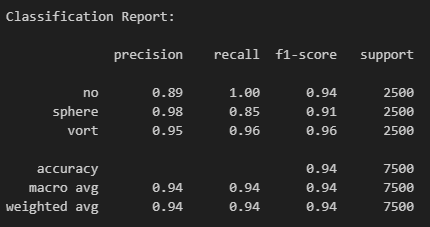
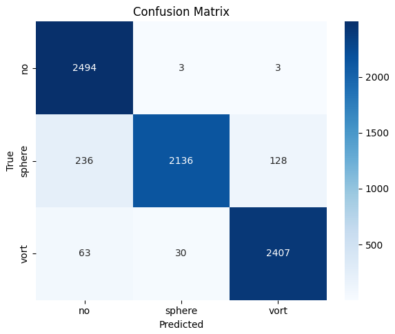
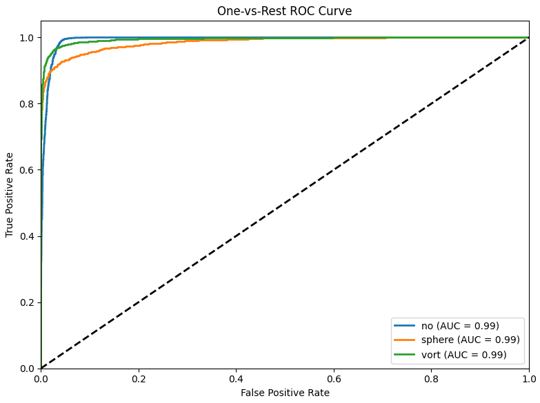

# Lens Substructure Classification with ResNet

## Project Overview
This project focuses on classifying strong lensing images into three categories based on their substructure:

- **No substructure** (`no`)
- **Subhalo substructure** (`sphere`)
- **Vortex substructure** (`vort`)

The goal is to accurately identify the type of substructure present in gravitational lensing images using deep learning techniques.

---

## Dataset Description

- **Format:** Grayscale images (1 channel) of shape `(1, 150, 150)`
- **Normalization:** Images have been pre-processed with min-max normalization
- **Training set:** 10,000 images per class (30,000 total)
- **Validation set:** 2,500 images per class (7,500 total)
- **Classes:** `['no', 'sphere', 'vort']`

---

## Model Architecture

The implementation uses a modified **ResNet-18** model with the following customizations:

- First convolutional layer adapted for single-channel (grayscale) input
- Final fully connected layer modified for 3-class classification
- Pretrained weights from ImageNet (`ResNet18_Weights.DEFAULT`)

---

## Training Details

- **Optimizer:** Adam with learning rate `1e-3`
- **Learning rate scheduler:** StepLR (`gamma=0.5` every 5 epochs)
- **Loss function:** CrossEntropyLoss
- **Batch size:** 64
- **Epochs:** 10

### Data Augmentation

- Random horizontal flipping
- Random rotation (±15 degrees)
- Normalization: `mean=0.485`, `std=0.229`

---

## Performance Metrics

The model evaluation includes:

- Classification report

  

- Confusion matrix visualization

  

- ROC curves with AUC scores for each class

  

---

## Usage

1. Update the `train_dir` and `val_dir` paths to point to your dataset.
2. Run the notebook cells sequentially to:
   - Load and preprocess the data
   - Initialize and train the model
   - Evaluate performance metrics
   - Visualize results

---

## Requirements

- Python 3.10.8
- PyTorch
- torchvision
- NumPy
- scikit-learn
- Matplotlib
- Seaborn
- PIL (Python Imaging Library)

The implementation is designed to run on **CUDA-enabled GPUs** when available, falling back to **CPU** otherwise.
