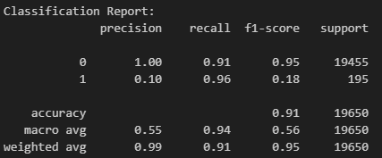
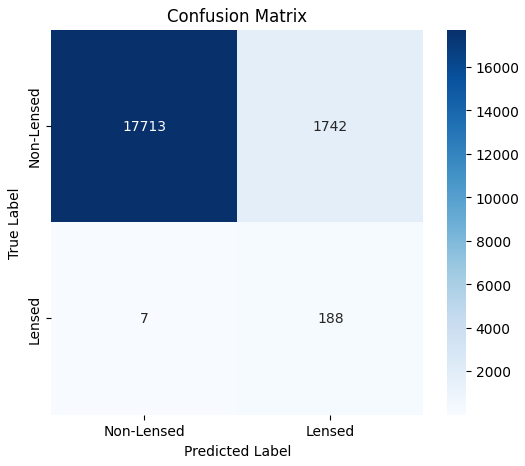
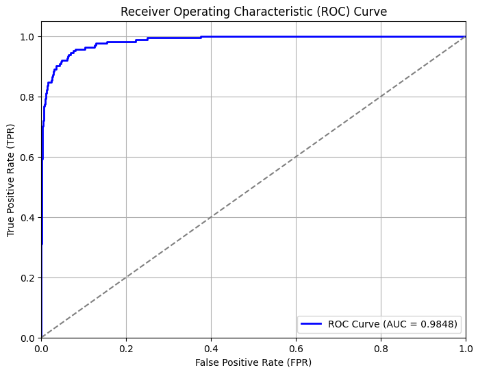

# Lens Detection Model using ResNet-34

## Overview
This project implements a deep learning model to classify astronomical images into **"lensed"** and **"non-lensed"** categories. The model is based on the **ResNet-34** architecture and is trained on a dataset of astronomical images to detect gravitational lensing phenomena.

---

## Key Features

- Uses **PyTorch** deep learning framework  
- Implements a **custom ResNet-34 classifier**
- Handles **class imbalance** through weighted sampling and focal loss
- Includes **data augmentation** techniques
- Provides **model evaluation metrics** (ROC-AUC, confusion matrix)
- Saves **trained model weights**

---

## Dataset

- **Training set:** 27,364 samples (90% train, 10% validation)
- **Test set:** 19,650 samples
- **Class distribution (train):**  
  - Lensed: 1,730  
  - Non-lensed: 28,675  
  - **Significant class imbalance**

---

## Techniques for Handling Class Imbalance

### 1. Weighted Random Sampling
- Implemented using `WeightedRandomSampler` and `SubsetRandomSampler`
- Creates balanced batches by oversampling the minority class
- **Oversampling ratio:** 1:5 (minority:majority)

### 2. Class Weighting in Loss Function
- Weights calculated as:  
  - Lensed = `total_samples / (2.5 * num_lensed)`  
  - Non-lensed = `total_samples / (2.5 * num_nonlensed)`
- Applied via a **custom Focal Loss**

### 3. Focal Loss
- Custom implementation for handling imbalance  
- Focuses on hard examples; down-weights easy ones  
- Parameters: `gamma=1`, `label_smoothing=0.02`  
- Formula:  
FL(pt) = -α * (1 - pt)^γ * log(pt)

### 4. Data Augmentation
- Applied to **training set only**:
- Random horizontal flips
- Random rotations (±10°)
- Color jitter (brightness=0.2, contrast=0.2)
- Random resized crops (`scale=(0.8, 1.0)`)

### 5. MixUp Augmentation
- Mixes pairs of examples + labels  
- Encourages robust decision boundaries  
- Parameter: `alpha=0.4`

---

## Model Architecture

- **Base model:** ResNet-34  
- **Final layer:** Modified for binary classification  
- **Input:** `64x64` grayscale images  
- **Output:** Lensed / Non-lensed

---

## Training Details

- **Loss Function:** Focal Loss with class weights
- **Optimizer:** Adam (`lr=5e-4`)
- **Scheduler:** StepLR (`gamma=0.5`, `step_size=5`)
- **Batch Size:** 64
- **Epochs:** 10
- **Data Augmentation:** As listed above

---

## Evaluation Metrics
- **Classification Report:**

  

- **Confusion Matrix:**

  

- **Validation ROC-AUC:**

  

---

## Usage

1. Load the dataset using the provided `LensDataset` class  
2. Initialize the model: `model = ResNet34Classifier().to(device)`
3. Train the model using the training loop
4. Evaluate on validation/test sets
5. Save model weights

---

## Requirements

- Python 3.x
- PyTorch
- torchvision
- numpy
- matplotlib
- seaborn
- scikit-learn

